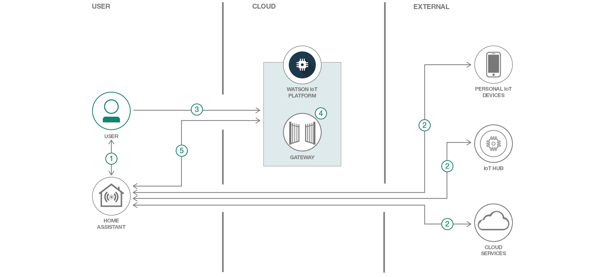
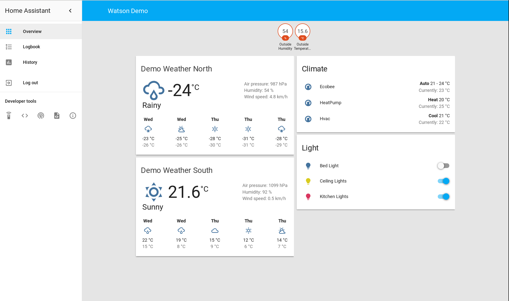
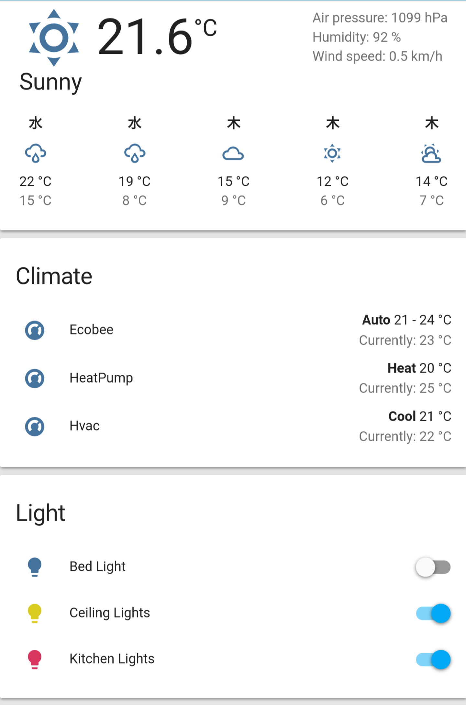
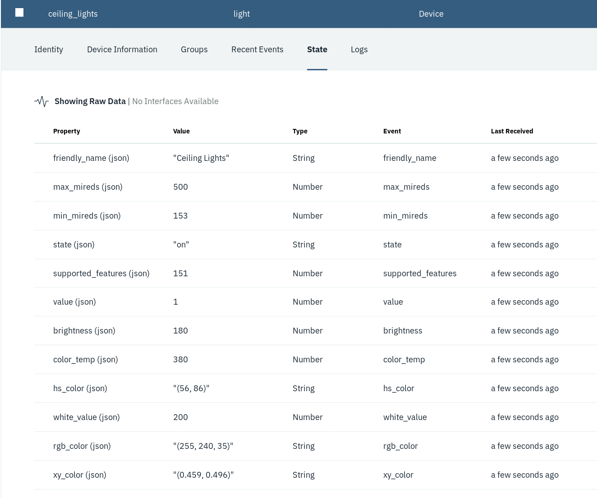

# WARNING: This repository is no longer maintained :warning:

> This repository will not be updated. The repository will be kept available in read-only mode.

# Connect your Home Automation system to Watson IoT Platform

Learn how to use Home-Assistant and Watson IoT Platform to build a unified interface to a home automation system.




# Steps

## 1. Setup Home Assistant

To start we'll need to setup Home assistant. The concept behind the project is
that you run Home assistant where the devices you want to connect are, in the
common case this is in your house.

There are several different ways to install and run Home assistant. These are
all covered in great depth in the Home assistant documentation here:

https://www.home-assistant.io/docs/installation/

This guide wiill cover 2 methods for doing it for demonstration purposes, running
locally in a python virtualenv and in IBM Cloud's Container Service.
While you can use either technique to deploy a production Home Assistant
instance, this guide will not cover configuring your own devices. It will only
use the demo devices in the bundled configuration in the repo. Refer to the
[Home Assistant documentation](https://www.home-assistant.io/docs/configuration/)
for how you want to configure it for your environment.

### Local setup

To setup a locally running home assistant in a virtual environment you'll need
to setup a few prerequisites first. You'll have to have a python 3 environment
installed already with a version >= 3.5 and pip must already be setup. Once
this is done you can simply run:

```
./setup.sh
```
in a terminal from the root of this repo. It'll create a
[virtualenv](https://docs.python.org/3/tutorial/venv.html) for Home Assistant
copy the demo configuration into and start it for you. You can kill the script
in your terminal to stop Home Assistant at any time, and the script will print
the command you'll need to restart it if you stopped it for any reason.

If you have a web browser on the machine you're running this from it will open
the Home Assistant web UI in your browser. For example:



If you don't have a browser on the machine you can access the web UI on port
8123. It is also a mobile friendly interface, so you can access the web UI
from your mobile device. For example:



If after using the script you want to remove everything for some reason you
can simply run:
```
./clean.sh
```
in a terminal from the root of this repo and it'll remove all artifacts from
the script.

### Running in IBM Cloud Kubernetes Service

If you don't want to run Home Assistant on a local machine for whatever reason,
for this you can also run it in the cloud. While most of the examples from this
repository will work fine when running Home Assistant in the cloud, it's worth
pointing out that for many Home Assistant components it is expected that they
have local access to a device. This is often incompatible with cloud deployment,
so if you choose this path, it may not be characteristic of how you would actual
deploy Home Assistant in a real usecase. Especially when you consider that
Home Assistant is designed to always work on a Raspberry Pi 3, the cost for
running locally is quite low.

To run this on the cloud you'll first need to have Kubernetes Helm installed.
Full instructions on installing it can be found at
[docs.helm.sh](https://docs.helm.sh/using_helm/#installing-helm)

After you have helm installed you'll need to create a kubernetes cluster. To
do this on IBM Cloud you run:
```
$ bx cs cluster-create <clustername>
```
Where <clustername> is the name of your cluster. We will use `hass` for this
from this point on. After your cluster is running you need to configure
kubectl for it. You do that with:

```
$ $(bx cs cluster-config hass | grep export)
```
and then initialize helm in your cluster with:
```
$ helm init
```
From here we need to configure a container registry where we'll upload the
Home Assistant docker image. To do this we need to create a namespace for this
application with:
```
$ bx cr namespace-add hass
```
Then we need to build the docker image and add it to the container registry in
the newly created namespace. You can do this from the root of the repo with:
```
$ bx cr build -t registry.ng.bluemix.net/hass/hass:1 images/hass
```
After image is built and uploaded it's time to deploy home assistant using helm.
This can be done by running from the root of the repo:
```
$ helm install deploy
```
This will autogenerate a unique name such as incendiary-gibbon. Helm allows you
to have more than one version of an application running at the same time in the
same cluster for developent, qa, or A/B testing purposes.

You can see the status of deployment with:
```
$ helm status <incendiary-gibbon>
```
Once the deployment is finished you'll be able to access the Home Assistant
web UI at the `EXTERNAL-IP` listed on the helm status page under the v1/Service
section. Just go to that address on port 8123 in your browser and you'll have
access to the Web UI

## 2. Adding a device to Home-Assistant

While the example config contains a few fake devices to showcase how
Home-Assistant can be used. There are a lot of devices and services that
Home-Assistant supports. You can see a full list of these in the Home Assistant
documentation here:

https://www.home-assistant.io/components/

While most of the components there require some additional setup or hardware.
The [demo platform](https://www.home-assistant.io/components/demo/) devices
(which is what is already used for the existing config) however don't and are
used solely to demonstrate how different classes of devices and services
would be used in Home Assistant. We'll be adding a new demo fan device to Home
Assistant here, but the basic steps are the same for real devices. You'll just
have to refer to the documentation for the particular component you're adding
to your instance for any required setup steps and/or hardware.

### Local Setup

To start open up the [images/hass/config/configuration.yaml](images/hass/config/configuration.yaml)
file in your text editor of choice. You should see the following contents:
```yaml
homeassistant:
    name: Watson Demo
    unit_system: metric
    time_zone: America/New_York

frontend:

history:

logbook:

http:
    server_host: 0.0.0.0
    base_url: 127.0.0.1:8123
    trusted_networks:
      - 127.0.0.1

climate:
    - platform: demo
      name: House Climate

weather:
    - platform: demo

light:
    - name: Hallway Light
      platform: demo
    - name: Kitchen Light
      platform: demo

sensor:
    - name: Doorbell
      platform: demo

#watson_iot_platform:
#    organization: organization_id
#    type: device_type
#    id: device_id
#    token: auth_token

```
This is the main yaml configuration file for Home Assistant. It describes both
information about the instance itself, like where it's physically located and
the connection information, and also contains which components are being used.
The lines that start with **#** are commented out. To add the fan devices we
want to append:
```yaml
fan:
  - platform: demo
```
to the end of the file. This says we're adding a single fan devices to our
Home Assistant installation, using the demo fan component. Once you've done this
you'll need restart the service to take the configuration changes. When you've
done this the dashboard will now show the 2 fan devices.

### Running in IBM Cloud Kubernetes Service

If you chose to run Home Assistant in the cloud this step can be skipped. To
manually add devices, it will require rebuilding the
[docker image](images/hass) used to run Home Assistant with an updated config
and then upgrading the helm deployment. This is a bit more involved then the
local steps. But, if you choose to do this the procedure is as follows:

Update the config in
[images/hass/config/configuration.yaml](images/hass/config/configuration.yaml)
just like in the local setup steps. Then you'll need to build a new version of
the image and upload it to your image registry. This can be done by running
from the repo root:
```
$ bx cr build -t registry.ng.bluemix.net/hass/hass:2 images/hass
```
You'll notice we've incremented the version number for the image. Once that
finishes you'll want to upgrade the deployment with helm. First you'll need
to edit [deploy/values.yaml](deploy/values.yaml) and change the `tag` field
under image from `1` to `2`. After you've updated the values.yaml you can
upgrade your deployment by running from the root of the repo:
```
$ helm upgrade <incendiary-gibbon> deploy
```
This will deploy upgrade the Home Assistant deployment with the new
configuration.

## 3. Deploy Watson IoT Platform
> Watson IoT Platform provides powerful application access to IoT devices and
data to help you rapidly compose analytics applications, visualization
dashboards, and mobile IoT apps. The steps that follow will deploy an instance
of the Watson IoT Platform service with the name `iotp-home-assistant` in your
IBM Cloud environment. If you already have a service instance running, you can
use that instance with the guide and skip this first step. Just make sure that
you use the correct service name and IBM Cloud space when you proceed through
the guides.

1. From the command line, set your API endpoint by running the bx api command.
Replace the `API-ENDPOINT` value with the API endpoint for your region.
```
bx api <API-ENDPOINT>
```
Example: `bx api https://api.ng.bluemix.net`
<table>
<tr>
<th>Region</th>
<th>API Endpoint</th>
</tr>
<tr>
<td>US South</td>
<td>https://api.ng.bluemix.net</td>
</tr>
<tr>
<td>United Kingdom</td>
<td>https://api.eu-gb.bluemix.net</td>
</tr>
</table>

2. Log into your IBM Cloud account.
```
bx login
```
If prompted, select the organization and space where you want to deploy Watson 
IoT Platform and the sample app. For example:

a) org: matthew.treinish@us.ibm.com  b) space = dev

3. Deploy the Watson IoT Platform service to IBM Cloud.
```
bx create-service iotf-service iotf-service-free $IOT_PLATFORM_NAME
```

For `$IOT_PLATFORM_NAME`, you can put anything, but for this guild we'll use
*iotp-for-home-assistant*. For example::

  bx create-service iotf-service iotf-service-free iotp-for-home-assistant

## 4. Register Home-Assistant with Watson IoT Platform.
For more information about registering devices, see:
[Connecting devices](https://console.bluemix.net/docs/services/IoT/iotplatform_task.html#iotplatform_subtask1).
  * In the IBM console, click **Launch** other Watson IoT Platform service
    details page. The Watson IoT Platform web console opens in a new browser tab
    at the following URL:

    https://ORG_ID.internetofthings.ibmcloud.com/dashboard/#/overview

    Where `ORG_ID` is the unique six character ID of [your Watson IoT Platform
    [organization](https://console.bluemix.net/docs/services/IoT/iotplatform_overview.html#organizations).
  * In the Overview dashboard, from the menu pane, select **Devices** and then
    click **Add Device**.
  * Create a device type for the device that you are adding.
      - Click **Create device type**.
      - Select **Gateway** as Type
      - Enter the device type name, this can be anything, but you want it to be
        descriptive. For example `iotp-home-assistant` and a description for
        the device type.
      - Optional: Enter device type attributes and metadata.
  * Click **Next** to begin the process of adding your device with the selected
    device type.
  * Enter a device ID, for example, `home-assistant`.
  * Click **Next** to complete the process.
  * Provide an authentication token or accept an automatically generated token.
  * Verify the summary information is correct and then click **Add** to add the
    connection.
  * In the device information page, copy and save the following details:
      * Organization ID
      * Device Type
      * Device ID
      * Authentication Method
      * Authentication Token. You'll need the values for the Organization
        ID, Device Type, Device ID, and Authentication Token to configure your
        device to connect to Watson IoT Platform.

## 5. Configure Home Assistant to use Watso IoT Platform
Now that you've registered the device type and device in your Watson IoT
platform instance it's time to configure Home Assistant to use it. We'll
need to add the configuration for the Watson IoT Platform [custom component](images/hass/config/custom_components/watson_iot_platform.py)
to our Home Assistant configuration.yaml file

### Local Setup

In the included [Home Assistant config](images/hass/config/configuration.yaml)
you'll see the outline for this already, just commented out:
```yaml
    watson_iot_platform:
        organization: organization_id
        type: device_type
        id: device_id
        token: auth_token
```
You'll want to uncomment this and copy the details you saved from the previous
step into each of these values. By doing this you'll be enabling Home Assistant
to report device status for every device it is configured to control or monitor.
After updating the configuration you'll want to restart the Home-Assistant
service however you've configured it to run.

After restarting Home-Assistant it will be running as a gateway device for the
Watson IoT Platform. As events occur in Home-Assistant it will send those
updates to the IoT Platform. If the event is for a device that the IoT Platform
isn't tracking yet it will be added. You can trigger these events by interacting
with the Home-Assistant web UI. Once a device is added you can track it's state
in the IoT Platform, for example:



### Running in IBM Cloud Kubernetes Service
Support for upgrading your cloud deployed Home Assistant with the Watson IoT
Platform configuration is prebuilt into the Docker images used. So unlike in
step 2 you do not need to rebuild the images manually to add the component.
This can be done by instead passing the Watson IoT Platform connection
information directly to helm. To do this you'll need to create a new yaml file.
This can live anywhere, but for the purposes of this demo we'll create a
values.yaml in the root of the repo (which is ignored by git). The contents
of this file are very similar to the Home Assistant configuration::
```yaml
watson_iot:
  enabled: 1
  organization: "organization_id"
  type: "device_type"
  id: "device_id"
  token: "auth_token"
```
where the values for organization, type, id, and token come from the details
you saved from the previous step. After creating this file we'll need to
upgrade the deployment with helm again. From the root of the repo run:

```
$ helm upgrade --values values.yaml <incendiary-gibbon> deploy
```
This will upgrade the deployment with the Watson IoT Platform support enabled.

# License
This code pattern is licensed under the Apache Software License, Version 2.  Separate third party code objects invoked within this code pattern are licensed by their respective providers pursuant to their own separate licenses. Contributions are subject to the [Developer Certificate of Origin, Version 1.1 (DCO)](https://developercertificate.org/) and the [Apache Software License, Version 2](http://www.apache.org/licenses/LICENSE-2.0.txt).

[Apache Software License (ASL) FAQ](http://www.apache.org/foundation/license-faq.html#WhatDoesItMEAN)
